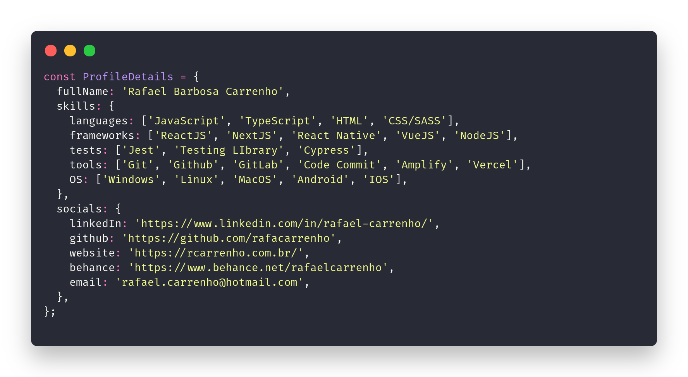

<h1 align="center">
    
</h1>

#### 👦 SOBRE MIM

Olá, sou o **Rafael Carrenho**, desenvolvedor **Front End** especialista em **JavaScript**, em especial com **ReactJS** e **NextJS** com mais de **2 anos de experiências** no mesmos e **8 anos de experiência** na área de **tecnologia**.

Entre minhas habilidades que me permitem ser um profissional extremamente qualificado estão a ótima comunicação, organização, atenção aos detalhes, além de vontade e empenho para sempre estar melhorando.

#### ⚔ SKILLS & TOOLS:

<code></code>
<code></code>
<code></code>
<code></code>
<code></code>
<code></code>
<code></code>
<code></code>
<code></code>
