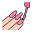

    

## 👦 SOBRE MIM

Olá, sou o **Rafael Carrenho**, desenvolvedor **Front End** especializado em **JavaScript**, com foco em **ReactJS** e **NextJS**. Ao longo da minha carreira, venho acumulando uma sólida experiência no desenvolvimento de soluções interativas e escaláveis.

Minhas principais habilidades incluem excelente comunicação, organização e atenção aos detalhes. Tenho um compromisso constante com a melhoria contínua, buscando sempre aprender novas tecnologias e metodologias para entregar soluções cada vez mais eficazes.

Ademais, sou um profissional proativo, sempre em busca de desafios que me permitam crescer e colaborar com equipes para alcançar resultados excepcionais.

 

## 📝 CONTATO

 

## ⚔ TECNOLOGIAS E FERRAMENTAS

<code></code>
<code></code>
<code></code>
<code></code>
<code></code>
<code></code>
<code></code>
<code></code>
<code></code>
<code></code>
<code></code>
<code></code>
<code></code>
<code></code>
<code></code>
<code></code>
<code></code>
<code></code>
<code></code>
<code></code>
